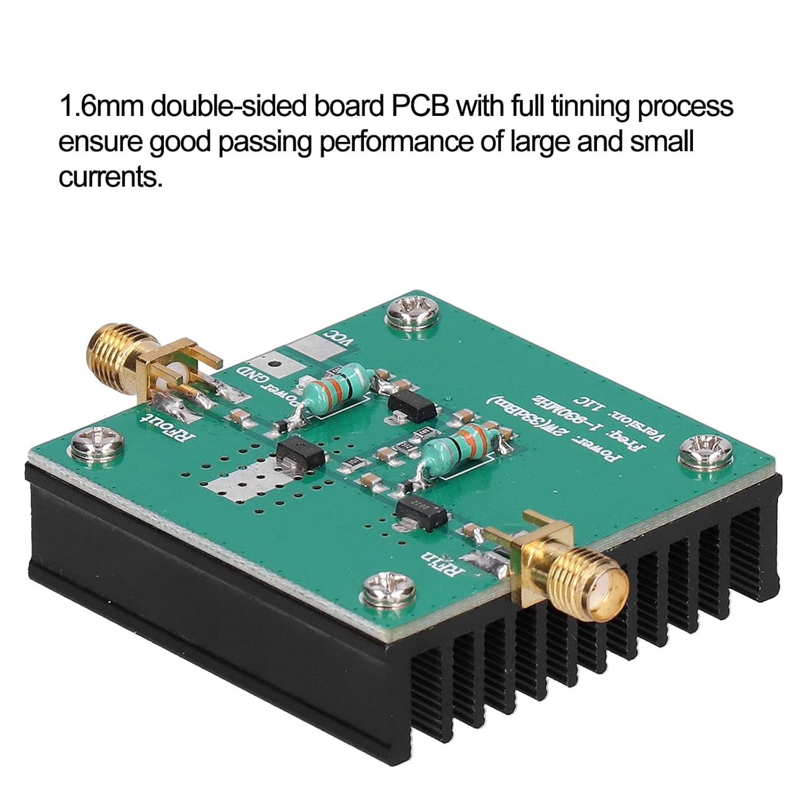
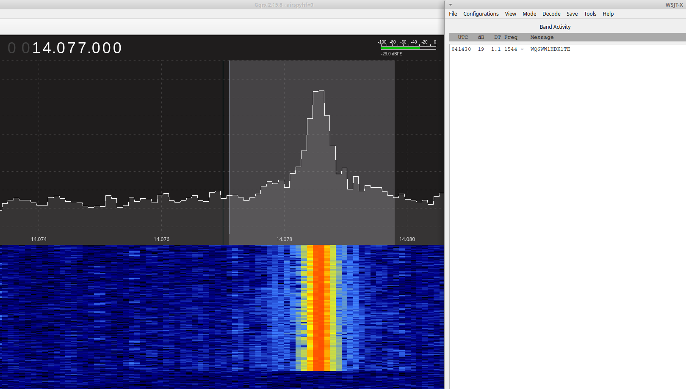

# Appreciation

First of all, many thanks to Roman for this brilliant WSPR project! The world
has never seen a WSPR beacon on such an inexpensive and small hardware ;-).

Simply ingenious is the controller-controlled oscillator, which can be
modulated to milliherzts - the heart of the beacon and the project!

As Roman writes in his project description: "It doesn't require any hardware -
Pico board itself only."

With this fork, the first transmission of the beacon can be triggered by a
button. And then, after the first transmission ends, it is repeated every 4
minutes controlled by the internal RTC of the Pi Pico. The interval for the
following transmission can be configured.

Dhiru: This fork adds FT8 support.

# Hardware Setup

NEW (Updated): Add a button between Pin 21 (`GP16`) and Pin 23 (`GND`) on the
Pico board.

The antenna connects to Pin 9 (`GP6`) on the Pico board.


# Bringing Pico beacon on air

Step 1: Configure the FT8 message (`char *message = "CQ K1TE FN42";`) to send
in the `WSPRbeacon/WSPRbeacon.c` file.

Step 2: Compile the project and copy the `build/pico-wspr-tx.uf2` file to the
Pico board.

```
mkdir -p ~/repos

cd ~/repos

git clone --recursive https://github.com/raspberrypi/pico-sdk.git

export PICO_SDK_PATH=$HOME/repos/pico-sdk

./build.sh

./picoload.sh build/pico-wspr-tx.uf2  # optional
```

Step 3: Power the Pico board

Step 4: Wait for the start time of the next FT8 transfer window. Press the
button to start the next broadcast.

Step 5: Use the WSJT-X software to check if the transfer is within the valid
transfer window. If necessary, repeat the start procedure.

# Amplifier?

https://github.com/kholia/HF-PA-v10/tree/master/IRFP-Hacks-v5-SMD is a pretty
rugged amplifier design for getting 1W to 30W RF output on all HF bands!

In a pinch, you can also try the `2W Amplifier 1-930MHz module` that is
available on Amazon, and other places.



# Demo



# References

- https://www.wavecom.ch/content/ext/DecoderOnlineHelp/default.htm#!worddocuments/ft8.htm

- https://github.com/kgoba/ft8_lib

- https://github.com/Jochen-bit/pico-WSPR-tx (We have used this fork)

- [100 LED solar garden light teardown (with schematic)](https://www.youtube.com/watch?v=DH4zTmrdc1o)
