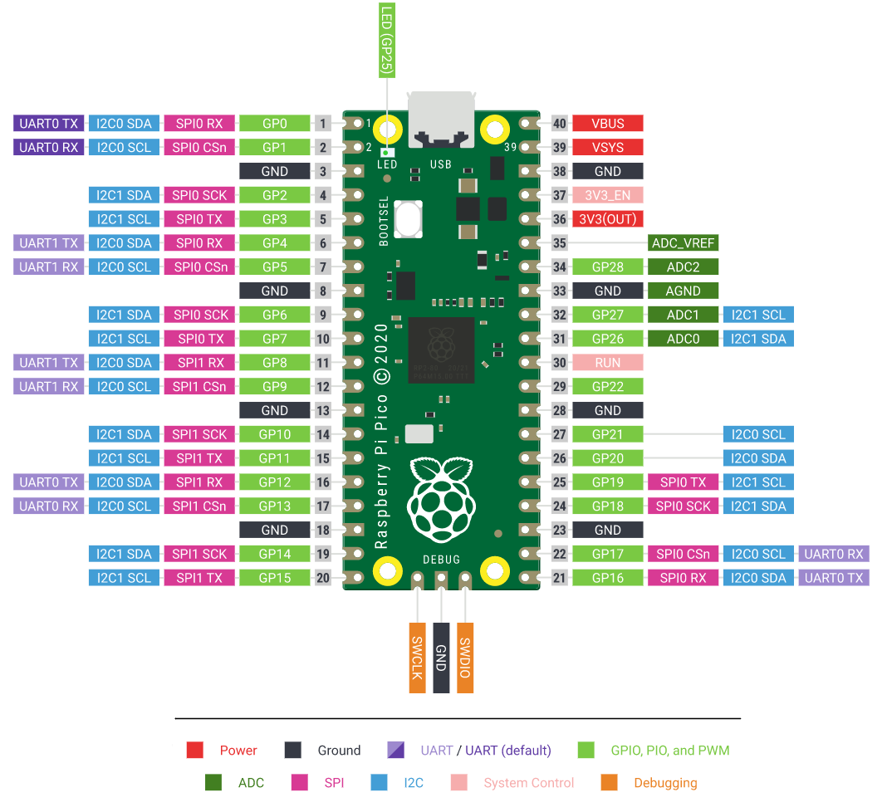
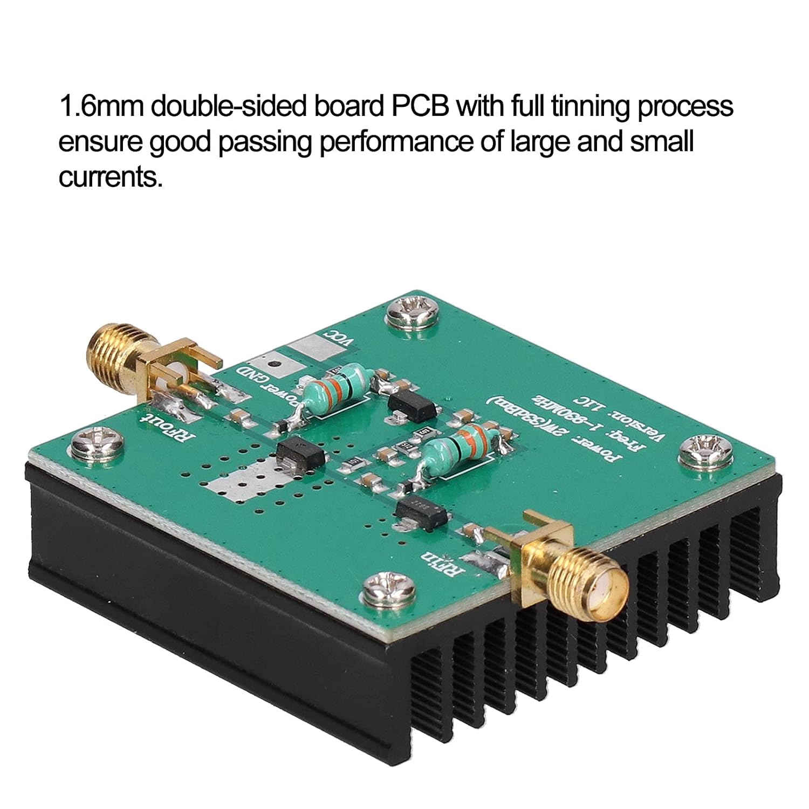
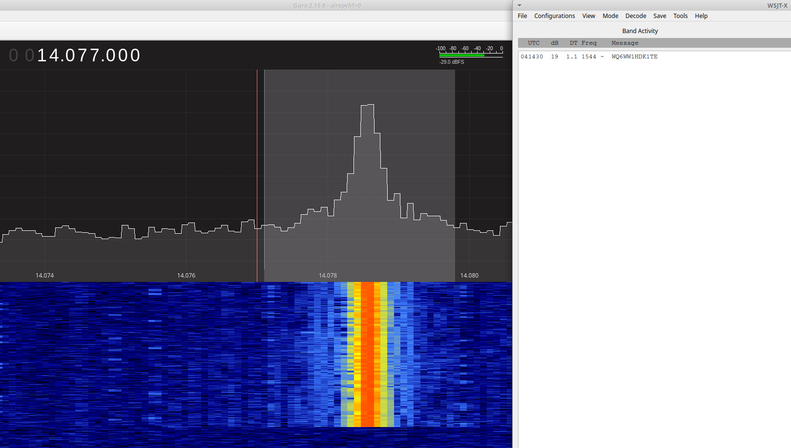
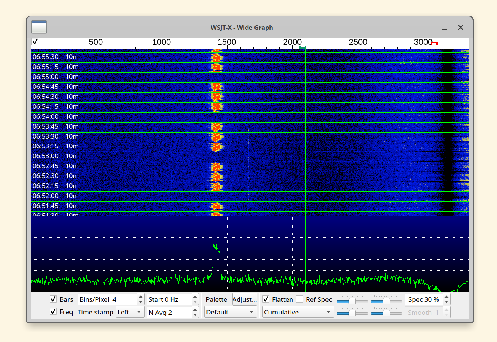

# Appreciation

First of all, many thanks to Roman for this brilliant WSPR project! The world
has never seen a WSPR beacon on such an inexpensive and small hardware ;-).

Simply ingenious is the controller-controlled oscillator, which can be
modulated to milliherzts - the heart of the beacon and the project!

As Roman writes in his project description: "It doesn't require any hardware -
Pico board itself only."

With this fork, the first transmission of the beacon can be triggered by a
button. And then, after the first transmission ends, it is repeated every 4
minutes controlled by the internal RTC of the Pi Pico. The interval for the
following transmission can be configured.

Dhiru: This fork adds AP mode configuration and FT8 and NTP support.

# Hardware Setup

The antenna connects to Pin 9 (`GP6`) on the Pico board.



# Bringing the beacon on air (USAGE)

Step 1: Copy `pico-wspr-tx.uf2` to the Pico 2 W board.

Step 2. Connect to the newly created `Pico-FT8-Setup` WiFi network.

Step 3: Open http://192.168.1.1 site and enter your actual WiFi network
details, callsign, grid, and band details.

Step 4: Hit the `Save` button on this same `captive portal` site.

Step 5: Use a SDR + WSJT-X software to check if the FT8 TX(es) are within the
desired band.

Step 6. You are done!

Note: Keep the oscope probe on 10X mode! Keep the `Invert` option `OFF` on the oscope!

Note 2: This version of the code is safe to use with an external amplifier.

# Amplifier?

Latest amplifier design is @ https://github.com/kholia/HF-PA-v10/tree/master/GSD-Hacks-v8 URL. Enjoy!

https://github.com/kholia/HF-PA-v10/tree/master/IRFP-Hacks-v5-SMD is a pretty
rugged amplifier design for getting 1W to 30W RF output on all HF bands!

In a pinch, you can also try the `2W Amplifier 1-930MHz module` that is
available on Amazon, and other places.



# Demo





```
$ pyserial-miniterm /dev/ttyACM0 
--- Miniterm on /dev/ttyACM0  9600,8,N,1 ---
--- Quit: Ctrl+] | Menu: Ctrl+T | Help: Ctrl+T followed by Ctrl+H ---
[+] Attempting WiFi connection (max 3 retries)...
[+] Connection attempt 1/3...
[+] cyw43_arch_wifi_connect_timeout_ms returned: 0
[+] WiFi connected successfully!
[+] Running NTP synchronization...
[+] NTP address is 162.159.200.1
[+] Got NTP response: 20/12/2025 06:42:40
00d00:00:09.142942 [BOOT] [0000] NTP synchronized at 06:42:40 UTC
[+] main_ntp_with_credentials() returned: 0
[+] ==========================================
[+]   WiFi Connected! NTP Synced!
[+]   Starting FT8 Transmission Mode!
[+] ==========================================
[+] Initializing FT8 transmission system...
[+] DCO initialized successfully
[DEBUG] powman_current=10080, powman_sync=9137, elapsed_ms=943
2025-12-20 06:42:40.943 [NTP] [0001] Hi from TxChannelInit!
[+] FT8 beacon context initialized
[+] Callsign: VU3CER
[+] Locator: MK68
[+] Dial Frequency: 28074000 Hz
[+] Launching oscillator on core 1...
[+] Oscillator core launched
[+] ==========================================
[+]   FT8 TRANSMISSION ACTIVE!
[+]   Broadcasting on 28074000 Hz
[+]   Callsign: VU3CER
[+]   Locator: MK68
[+] ==========================================
[+] FT8 transmission slot reached at 06:42:45! Starting TX...
Packed data: 00 00 00 27 1f 36 dc 96 23 08 
FSK tones: 3140652000000001141754447112052027503140652647265175570207753223415102003140652
[+] Waiting for transmission to complete...
[+] FT8 transmission completed!
...
```

# References

- https://www.wavecom.ch/content/ext/DecoderOnlineHelp/default.htm#!worddocuments/ft8.htm

- https://github.com/kgoba/ft8_lib

- https://github.com/Jochen-bit/pico-WSPR-tx (We have used this fork)

- [100 LED solar garden light teardown (with schematic)](https://www.youtube.com/watch?v=DH4zTmrdc1o)
